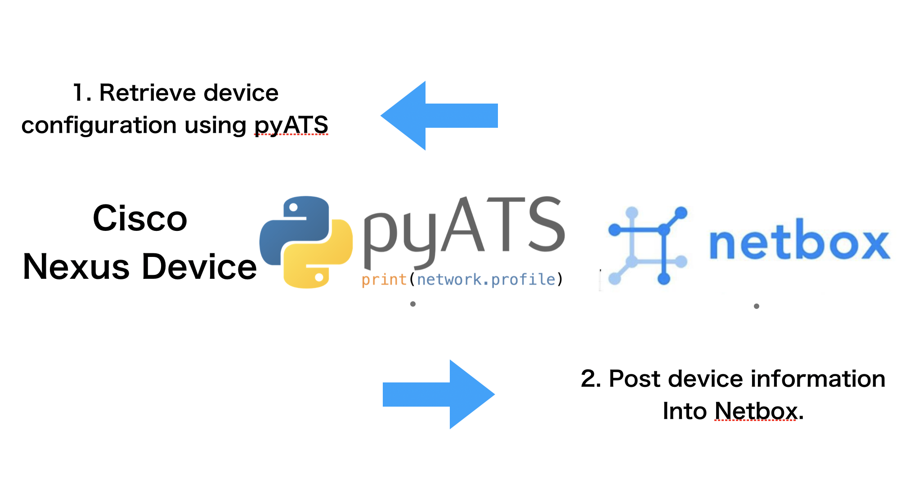

# Get started managing your inventory by Netbox!
I built this application as a kick start Netbox tool with our network devices.

## Functions
In main2.py file 

The technologies used in this demonstration are:

<liNetbox - A modern IPAM and DCIM tool, written in Python and providing robust programmability support through APIs and SDKs
pyATS - A network verification and configuration tool used to gather operational and configuration details from a live network, as well as make configuration changes.
Docker - A container technologies used to "package" up the application into a portable image that can be run nearly anywhere
Cisco NX-OS - A programmable network operating system providing many features, including running containers on the switch.
Webex Teams - An collaboration platform offering rich communication and programmability features allowing for robust ChatOps use cases.